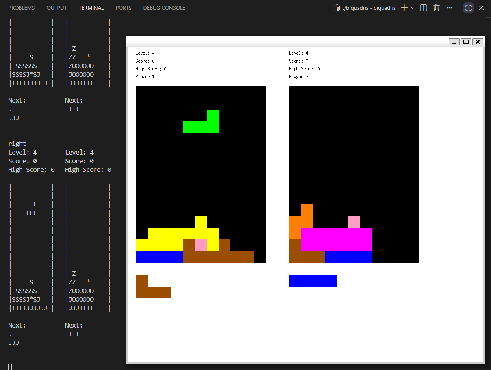
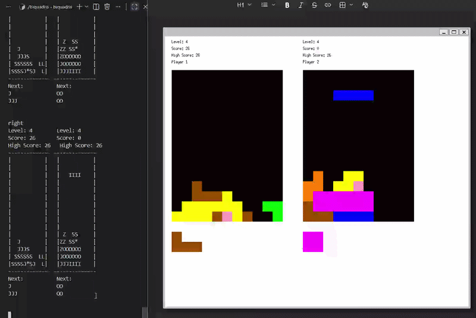
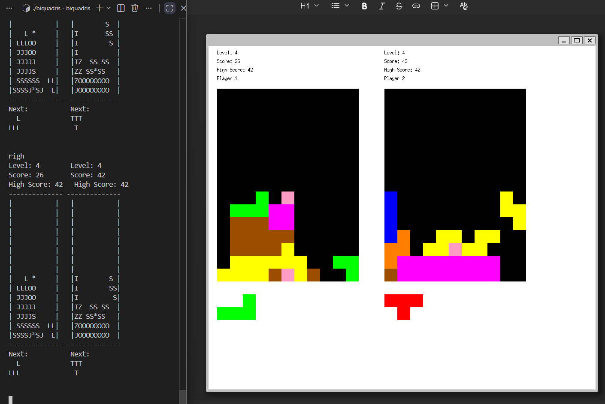
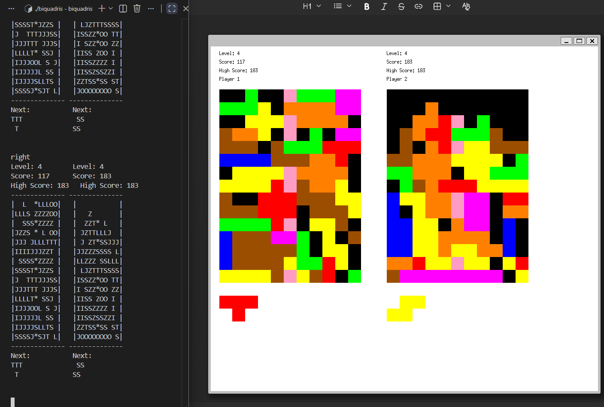

# Biquadris
Created a Tetris-insipired game called Biquadris using C++ with Object Oriented Principles. The game has a Graphic User Interface made using XWindows. There is also text display on the side as well. The project focused on the concepts of OOP and the capabilities of C++ as a coding language.

## Features
Play against one other player in Biquadris, each player takes turns moving and dropping their block into their own grid. Gain points for clearing rows and compete against your opponent, High Scores are tracked as game progresses.

Increase the difficulty level, which adds penalties for not clearing rows, special actions to hinder your opponent's board and falling blocks to add pressure and punish indecisiveness.

The game ends when one player is unable to place anymore blocks into their own grid.

## Note
Source code is private due to university academic integrity policies. This repository is intended for portfolio/showcase purposes only.
